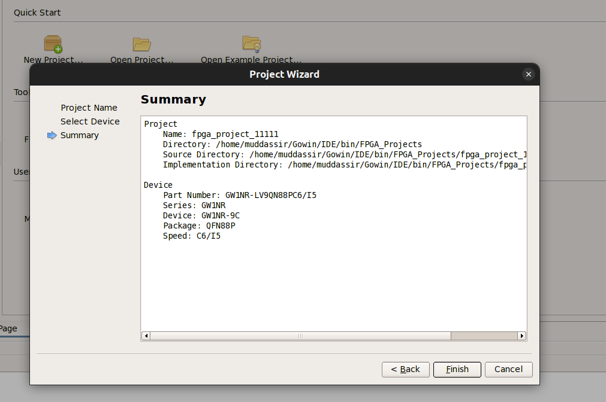
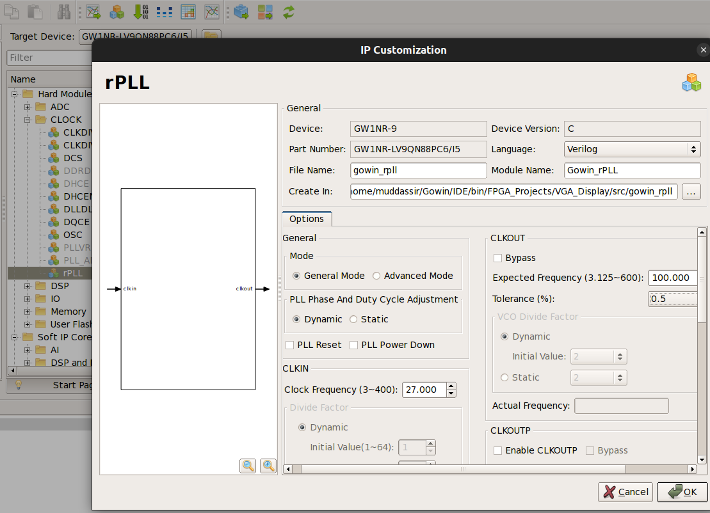
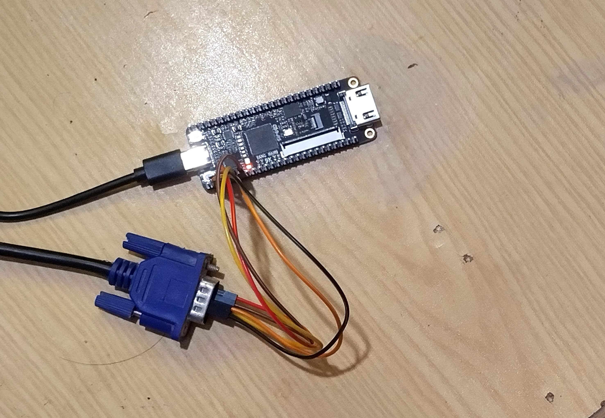
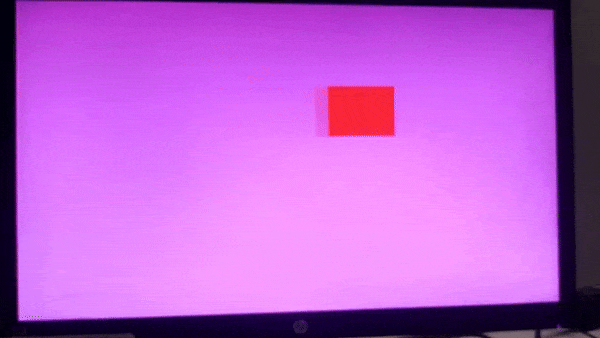

# Gowin IDE Setup for VGA Display Project

This document provides step-by-step instructions for setting up and configuring the **VGA_Display** project in Gowin IDE for the Tang Nano 9K FPGA.

## 1. **Create a New Project**

- Open Gowin IDE.
- Create a new project and name it `VGA_Display`.

 
 

## 2. **Set Configuration**

- Configure the project with the necessary settings.

 
 
 

- Use built-in IPs for the clock divider since the Tang Nano 9K FPGA operates at 27 MHz, but the LCD requires a 25 MHz clock. The IP will help adjust the clock frequency accordingly.
 
 
 
 

## 3. **Create Verilog Files and .cst File**

- Ensure that the names of your Verilog files and `.cst` file match exactly.

 
 

- Copy and paste the content from the existing files into the files you just created.
  
  **Note:** If you generate the bitstream without a `.cst` file, the configuration will not work correctly.

## 4. **Alternative Method**

- Instead of manually creating the project, you can copy the folder `VGA_Display/gowin/VGA_Display` and paste it into your Gowin IDE installation path:
  ```bash
  /path/to/Gowin/IDE/bin
  ```
- Open the project from within Gowin IDE after copying.

## 5. **Compile and Generate Bitstream**

- Once your project is set up in Gowin IDE, compile and generate the bitstream.
- This may take a few seconds. Ensure there are no errors in the compilation.
 
 

## 6. **Locate the Bitstream File**

- After successfully generating the bitstream, navigate to the folder where it is stored:
  ```bash
  /path/to/Gowin/IDE/bin/VGA_Display/impl/pnr
  ```
- The `.fs` file should be located here.

- **Note:** Create a new folder with the **same name** as the `.fs` file. Copy the both `.fs` and `.cst` file into this folder and open it using VSCode for further operations.

## 7. **Connect FPGA and LCD**

- Make sure the Tang Nano 9K FPGA is properly connected.
- Attach the VGA cable to the LCD and FPGA according to the pin assignments specified in the `.cst` file.

 
 
 

## 8. **Run the Program**

- Open VSCode, and at the bottom right corner of the screen, look for the **FPGA Toolchain**.

 

- Select the **"Run Program Only"** option to load the bitstream onto the FPGA.

 

 