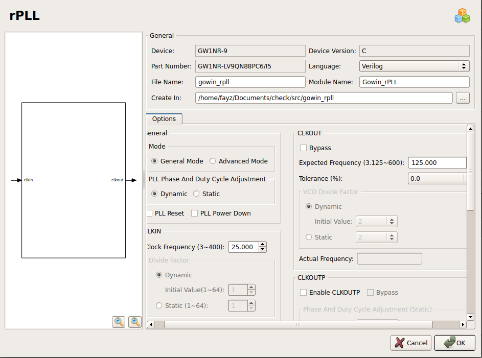

 This This document provides step-by-step instructions for setting up and configuring the **HDMI_Display** project in Gowin IDE for the Tang Nano 9K FPGA.

 You can follow the steps 1 and 2 from here [README file](https://github.com/Fayz2110/VGA-controller/blob/main/VGA_Display/README.md)

##  **IP's for HDMI**

- As you can see there are two clocks in DVI IP.The 125Mhz clock required for serialization of RGB,where as 25Mhz required for Tmds encoder for RGB
- 
- Follow step 3 to 6 from here [README file](https://github.com/Fayz2110/VGA-controller/blob/main/VGA_Display/README.md)
##  **CONNECT FPGA**
- Connect FPGA with laptop,an led will be on FPGA.
- make the constraint file
 - 
 -   
 -   Program the FPGA.
 -   Connect the HDMI cable with FPGA and screen.
  ##  **OUTPUTS**
   - 
    - 
